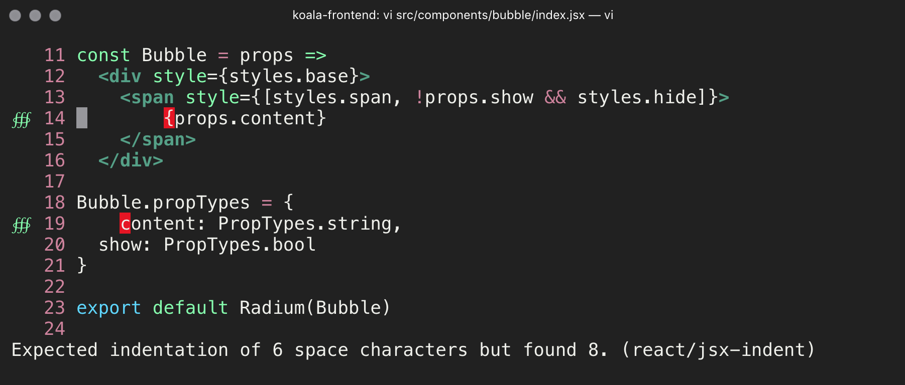

# hyper-captain-sweetheart

> tuff but sweet [hyper](https://hyper.is) theme

## Install

Add `hyper-captain-sweetheart` to the plugins list in your `~/.hyper.js` config file.

## Tip

Bubble screenshot in Vim with JSX syntax and ESLinting. [view my .vimrc](https://gist.github.com/mashaal/8a3a6c498392ae2944a3b2a8b2bd5144)

## License

MIT © [omar mashaal](https://teacups.io)

Illustration by [xuh](http://gimb.tumblr.com)
