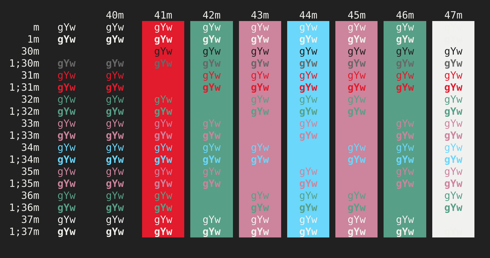

# hyper-captain-sweetheart

> tuff but sweet [hyper](https://hyper.is) theme

## Install

Add `hyper-captain-sweetheart` to the plugins list in your `~/.hyper.js` config file.

## License

MIT © [omar mashaal](https://teacups.io)
